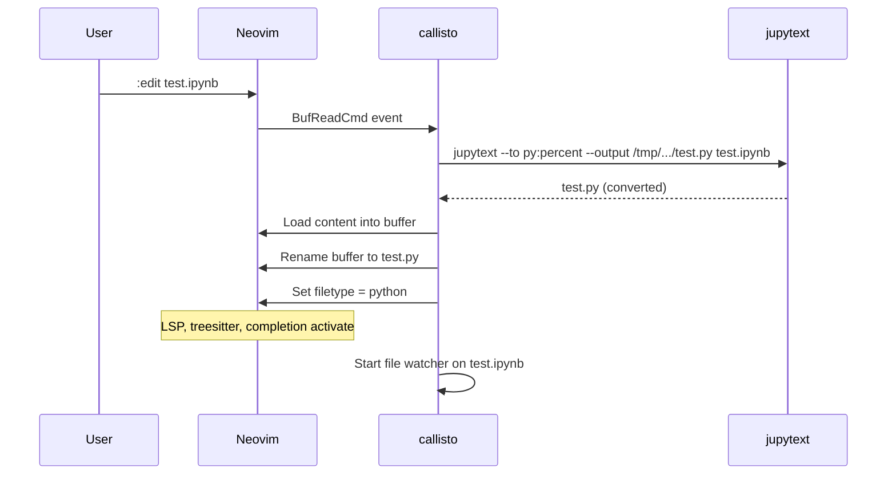
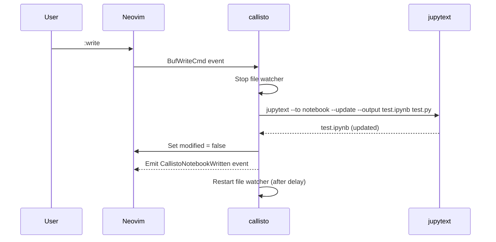
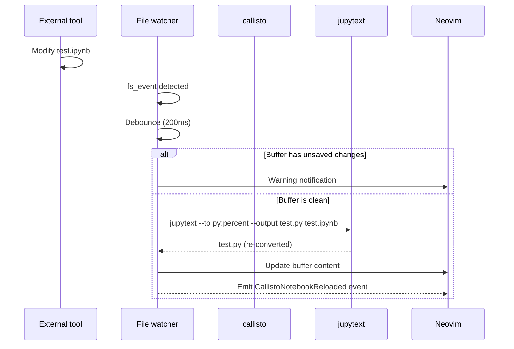
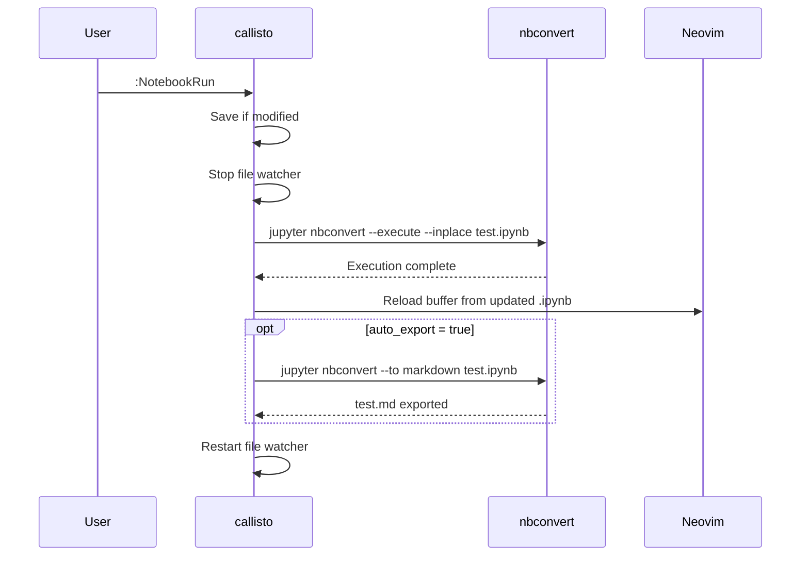

# Architecture

## Module Overview

```
lua/callisto/
  init.lua        Setup, config defaults, buffer state management, autocmd registration
  converter.lua   jupytext I/O: read (.ipynb -> .py), write (.py -> .ipynb), cleanup
  watcher.lua     File system watcher (libuv fs_event) with debounce
  commands.lua    User commands: NotebookRun, NotebookExport
  util.lua        Shared helpers: notify, get_buf_state, run_sync, run_async
  health.lua      :checkhealth callisto

ftdetect/
  ipynb.lua       Register ipynb filetype
```

## Data Flow

### Opening a notebook

When you open a `.ipynb` file, callisto intercepts the read via `BufReadCmd` and converts it to a Python script using jupytext. The buffer is renamed to `.py` so LSP servers (Pyright, ruff, etc.) attach correctly.



### Saving changes

On `:w`, callisto writes the buffer content to the `.py` file, then uses jupytext to convert it back to `.ipynb`. The `--update` flag preserves existing output cells (execution results, plots, etc.).



### External change detection

When an external tool (e.g. `jupyter`, Claude Code) modifies the `.ipynb` file, the file watcher detects the change, re-converts via jupytext, and updates the buffer.



### Notebook execution

`:NotebookRun` executes the notebook in-place using `jupyter nbconvert`. If `run.auto_export` is enabled, it automatically exports the results to Markdown.



## Module Interactions

Modules are decoupled via User autocmd events instead of direct function calls:

- `converter.lua` emits `CallistoNotebookWritten` after a successful write
- `watcher.lua` emits `CallistoNotebookReloaded` after reloading from an external change

This allows users to hook into these events for custom workflows without modifying the plugin.

## Buffer State

Each managed buffer has a `callisto.BufState` entry in `_buffers`:

| Field | Type | Description |
|-------|------|-------------|
| `ipynb_path` | `string` | Absolute path to the `.ipynb` file |
| `tmp_py` | `string` | Path to the `.py` file (tmpdir or alongside `.ipynb` in sync mode) |
| `tmpdir` | `string?` | Path to temporary directory. `nil` in sync mode (no cleanup) |
| `watcher` | `userdata?` | libuv `fs_event` handle |
